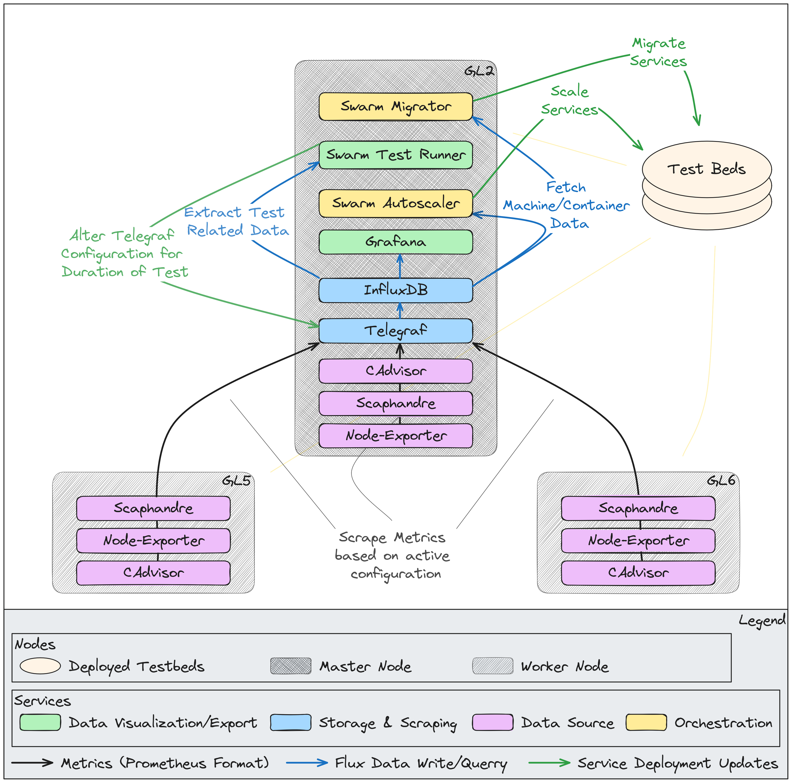

# greenlab-docker-swarm

## Cluster Configuration (GreenLab)

## About
This repository contains the toolkit for gathering, processing and exporting machine metrics with a focus on power consumption.
It also provides services that provide container orchestrating techniques with a focus on energy efficiency optimizations.

Each module contains its own `README.md` where you can find more information about how the modules are implemented as well as usage instructions.

### General
- Containerization Platform: [Docker](https://docs.docker.com/engine/swarm/)

### Available metrics
- [CAdvisor](https://github.com/google/cadvisor/blob/master/docs/storage/prometheus.md): Analyzes resource usage and performance characteristics of running containers. 
- [Scaphandre]()
- [Node-Exporter]()

