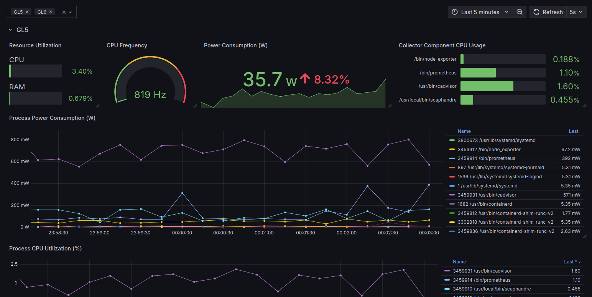
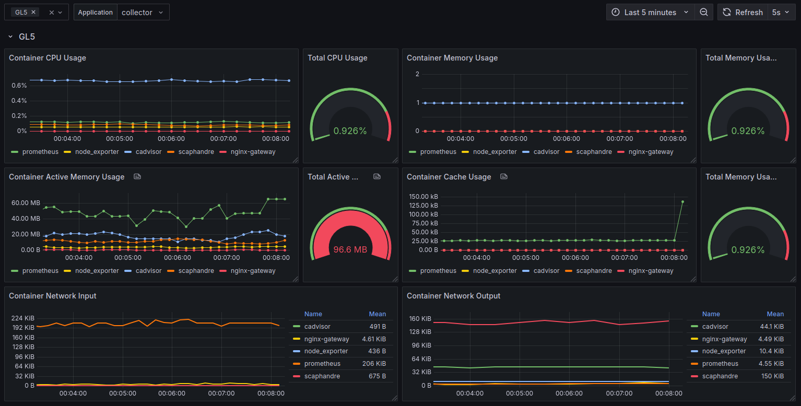

# 📊 PeekStack

This repository provides a toolkit for **gathering**, **processing**, and **visualizing** machine metrics — with a focus on **power consumption** — using a containerized stack based on [Docker](https://docs.docker.com/engine/).

---

## Available Metrics

The stack includes the following Prometheus-compatible exporters:

- 🔍 **[cAdvisor](https://github.com/google/cadvisor/blob/master/docs/storage/prometheus.md)**  
  Collects resource usage and performance characteristics of running containers.

- ⚡ **[Scaphandre](https://hubblo-org.github.io/scaphandre-documentation/references/metrics.html)**  
  Measures power and energy consumption on bare-metal Linux machines.

- 🖥 **[Node Exporter](https://github.com/prometheus/node_exporter)**  
  Provides system-level metrics such as CPU, memory, disk, and network usage.

---

## Deployment

### 🔹 Collectors

To deploy the **Collector** stack, which exposes the metrics to Prometheus:

➡️ See the [`collector/README.md`](./collector/README.md) for setup and deployment instructions.

---

### 🔹 Interface

The **Interface** stack includes a preconfigured **Grafana** dashboard that connects to one or more Prometheus datasources.

#### Setup Prometheus Datasource in Grafana

To connect to the `collector` stack:

1. Add a new Prometheus datasource using the credentials configured during its setup.
2. Enable **“Skip TLS verification”** under the TLS settings (if using self-signed certificates).

Once configured, Grafana will be accessible at:

`http://<your-machine-ip>:13000/`

> 📍 Default port for Grafana is `13000`

---

## Example Dashboards

### Monitoring System-level status

### Monitoring Containerized Applications in Docker

## ⚠️ Known Limitations

- ⏱ **Scaphandre Polling Rate**:  
  Energy metrics can only be scraped once every **2 seconds** (as of `v1.0.2`). Using lower scrape intervals will result in failed requests or missing energy related data.

---
